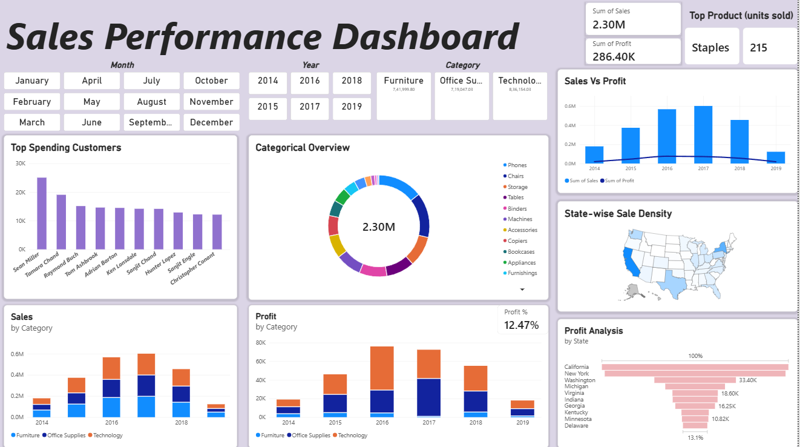

# 📊 Sales Performance Dashboard


An interactive single-page **Sales Performance Dashboard** built using Power BI Desktop. The dashboard analyzes retail sales trends across time (2014–2019), geography, product categories, customer segments, and overall profitability metrics.

---

## 🖼️ Dashboard Preview




---

## 📈 Key Metrics & KPIs

* **Total Sales Revenue:** $2.30M
* **Total Profit:** $286.40K
* **Profit Margin:** 12.47%
* **Top Product (Units Sold):** Staples (215 units)

---

## 🔍 Visualizations & Features Breakdown

### 1. Interactive Slicers & Navigation
* **Month Slicer:** Granular monthly filtering from January through December.
* **Year Slicer:** Multi-year timeline options covering **2014, 2015, 2016, 2017, 2018, and 2019**.
* **Category Slicer:** Quick filtering across core product categories:
  * **Technology:** $836,154.03
  * **Furniture:** $741,999.80
  * **Office Supplies:** $719,047.03

### 2. Comprehensive Analytics Visuals
* **Categorical Overview (Donut Chart):** Shows the distribution of total revenue ($2.30M) across key sub-categories including *Phones, Chairs, Storage, Tables, Binders, Machines, Accessories, Copiers, Bookcases, Appliances, and Furnishings*.
* **Sales Vs Profit (Combo Chart):** Tracks annual revenue against net profit trajectory across 2014–2019, showing revenue growth peaking in 2017.
* **Top Spending Customers (Bar Chart):** Ranks top revenue-generating customers led by **Sean Miller**, followed by *Tamara Chand, Raymond Buch, Tom Ashbrook, Adrian Barton,* and *Ken Lonsdale*.
* **State-wise Sale Density (US Map):** Visualizes geographical sales distribution across US states, showing strong sales volume in California, New York, and Texas.
* **Sales by Category (Stacked Column Chart):** Illustrates annual revenue breakdown across Furniture, Office Supplies, and Technology from 2014 to 2019.
* **Profit by Category (Stacked Column Chart):** Details net profit trends by category per year alongside an overall **Profit % of 12.47%**.
* **Profit Analysis by State (Funnel Chart):** Ranks profitability by state, highlighting top performers such as **California** (100%), **New York**, **Washington** ($33.40K), **Virginia** ($18.60K), **Georgia** ($16.25K), and **Minnesota** ($10.82K).

---

## 💡 Key Business Insights

1. **Technology Dominance:** Technology generates the highest sales revenue (~$836K) and serves as the primary profit driver.
2. **Geographic Distribution:** California and New York serve as the highest profit-yielding states.
3. **Product Volume:** **Staples** achieved the highest unit sales with 215 units sold.
4. **Temporal Trajectory:** Sales revenue experienced strong annual performance, peaking between 2016 and 2017.

---

## 🛠️ Tech Stack & Tools

* **Analytics Platform:** Microsoft Power BI Desktop
* **Data Modeling & Calculations:** DAX (Data Analysis Expressions)
* **ETL & Data Processing:** Power Query
* **Visuals:** Donut Chart, Combo Chart, Stacked Column Chart, Funnel Chart, US Map Visual, Custom KPI Cards & Button Slicers

---

## 🚀 How to Run & View

1. **Clone the Repository:**
   ```bash
   git clone [https://github.com/YOUR_USERNAME/Sales-Performance-Dashboard.git](https://github.com/YOUR_USERNAME/Sales-Performance-Dashboard.git)
